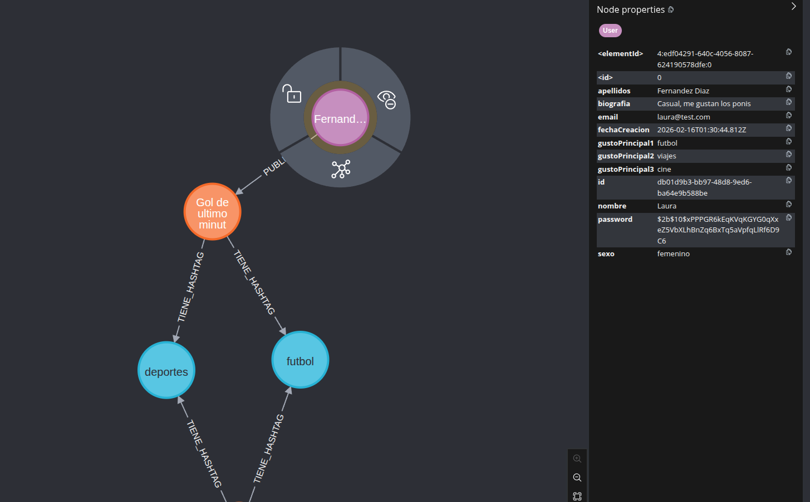
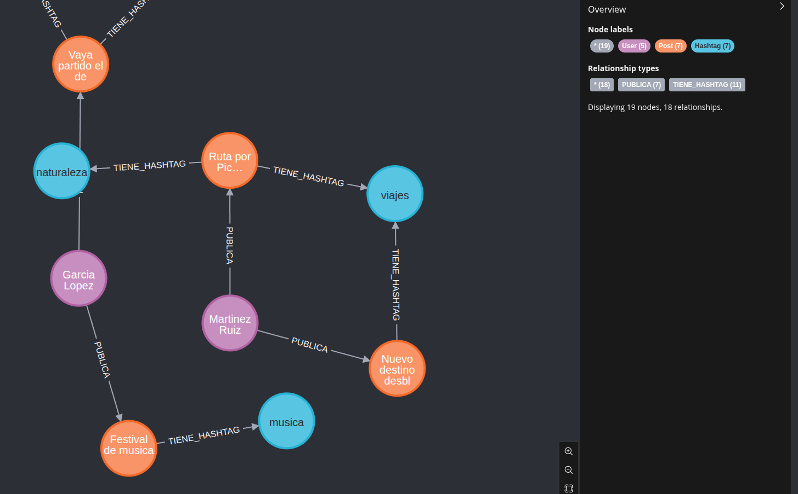
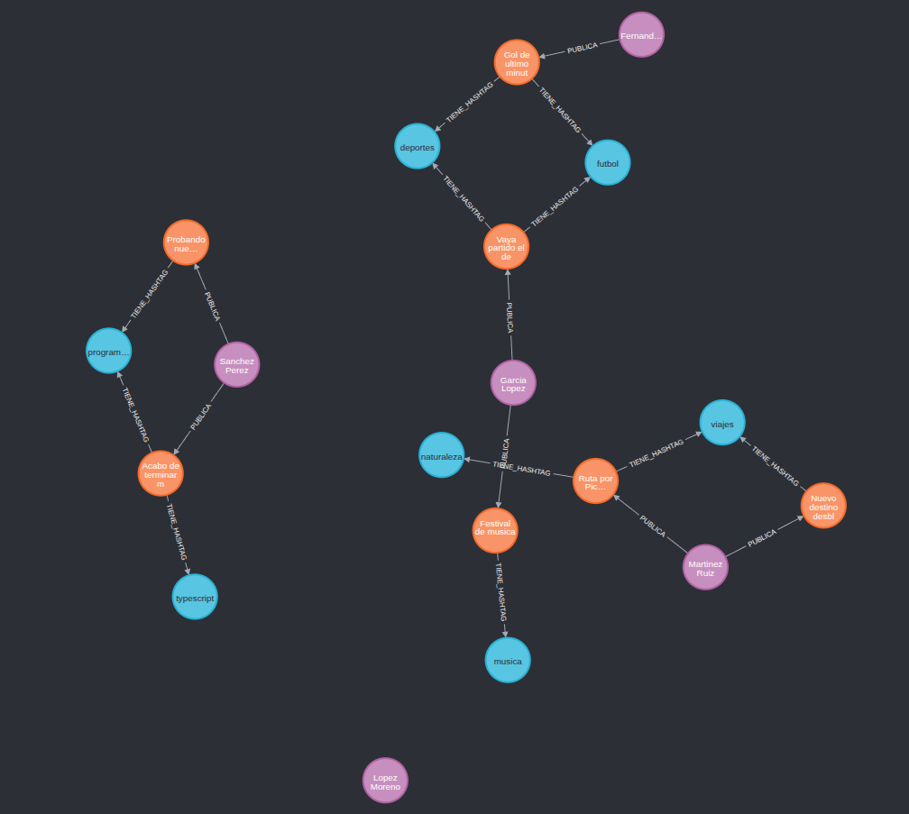

# DataSocial

<p align="center">
  
  
  
</p>

**DataSocial** es una aplicación, API REST y base de datos que en conjunto forman DataSocial, una aplicación que busca conectar a gente entre sí mediante palabras claves y técnicas de relaciones usadas en Ciencias de datos y en bases de datos orientadas a grafos, el proyecto busca expandirse para implementar operaciones de big data.

## Tecnologias utilizadas

### Backend

<p align="center">
  
  
  
  
</p>

### Frontend (Mobile)

<p align="center">
  
  
  
  
  
  
</p>

### Infraestructura

<p align="center">
  
  
  
</p>

## Arquitectura

```
Cliente (React Native)  -->  API REST (Express)  -->  Neo4j (Grafos)
```

La API sigue el patron **Route -> Controller -> Service -> Neo4j**:

```
src/
  app.ts                  # Punto de entrada, servidor Express
  config/
    config.ts             # Variables de entorno (config.env)
  database/
    neo4j.ts              # Conexion singleton al driver Neo4j
  types/
    User.ts               # Interfaces User, CreateUserInput, LoginInput
    Post.ts               # Interfaces Post, CreatePostInput
    Hashtag.ts            # Interface Hashtag
  services/
    userService.ts        # Queries Cypher para usuarios
    postService.ts        # Queries Cypher para posts y hashtags
  controllers/
    userController.ts     # Handlers HTTP de usuarios
    postController.ts     # Handlers HTTP de posts
  routes/
    userRoutes.ts         # Endpoints /api/users
    postRoutes.ts         # Endpoints /api/posts
  middlewares/
    errorHandler.ts       # Middleware global de errores
```

## Modelo de datos (Grafo)

```
(:User)-[:PUBLICA]->(:Post)-[:TIENE_HASHTAG]->(:Hashtag)
```

Los usuarios se conectan entre si a traves de:
- **Gustos principales** compartidos (gustoPrincipal1, gustoPrincipal2, gustoPrincipal3)
- **Hashtags** en comun en sus publicaciones

<p align="center">  </p>

## Endpoints de la API

### Usuarios `/api/users`

| Metodo | Ruta | Descripcion |
|--------|------|-------------|
| `POST` | `/api/users/registro` | Registrar un nuevo usuario |
| `POST` | `/api/users/login` | Iniciar sesion |
| `GET` | `/api/users` | Listar todos los usuarios |
| `GET` | `/api/users/:id` | Obtener usuario por ID |
| `GET` | `/api/users/:id/afinidad` | Ranking de afinidad combinado |
| `PUT` | `/api/users/:id` | Actualizar usuario |
| `DELETE` | `/api/users/:id` | Eliminar usuario |

### Posts `/api/posts`

| Metodo | Ruta | Descripcion |
|--------|------|-------------|
| `POST` | `/api/posts` | Crear post con hashtags |
| `GET` | `/api/posts` | Listar todos los posts |
| `GET` | `/api/posts/usuario/:userId` | Posts de un usuario |
| `GET` | `/api/posts/similares/:userId` | Usuarios con hashtags comunes |
| `DELETE` | `/api/posts/:id` | Eliminar post |

## Sistema de afinidad

El endpoint `GET /api/users/:id/afinidad` calcula un ranking combinado:

1. **Gustos en comun**: compara los 3 gustos principales entre usuarios
2. **Hashtags en comun**: busca hashtags compartidos a traves de posts
3. **Puntuacion**: suma de gustos + hashtags coincidentes

```json
[
  {
    "id": "abc-123",
    "nombre": "Maria",
    "apellidos": "Martinez",
    "gustosComunes": ["viajes", "musica"],
    "hashtagsComunes": ["futbol"],
    "numGustos": 2,
    "numHashtags": 1,
    "puntuacionAfinidad": 3
  }
]
```

<p align="center">  </p>

## Instalacion

### Requisitos previos

- [Node.js](https://nodejs.org/) v18 o superior
- [Docker](https://www.docker.com/) instalado y corriendo
- [npm](https://www.npmjs.com/)

### 1. Clonar el repositorio

```bash
git clone https://github.com/alaslibress/DataSocial.git
cd DataSocial
```

### 2. Levantar la base de datos Neo4j con Docker

```bash
docker run -d \
  --name datasocial-neo4j \
  -p 7474:7474 \
  -p 7687:7687 \
  -e NEO4J_AUTH=neo4j/Rosaprofe.11 \
  -v datasocial-neo4j-data:/data \
  neo4j:5
```

### 3. Configurar la base de datos

Acceder a http://localhost:7474 (usuario: `neo4j`, contrasena: `Rosaprofe.11`) y ejecutar los constraints:

```cypher
CREATE CONSTRAINT usuario_email_unico IF NOT EXISTS
FOR (u:User) REQUIRE u.email IS UNIQUE;

CREATE CONSTRAINT usuario_id_unico IF NOT EXISTS
FOR (u:User) REQUIRE u.id IS UNIQUE;

CREATE CONSTRAINT post_id_unico IF NOT EXISTS
FOR (p:Post) REQUIRE p.id IS UNIQUE;

CREATE CONSTRAINT hashtag_nombre_unico IF NOT EXISTS
FOR (h:Hashtag) REQUIRE h.nombre IS UNIQUE;
```

> Para datos de prueba, consultar el archivo `setup-neo4j-docker.txt` del proyecto.

### 4. Configurar variables de entorno

Crear un archivo `config.env` en la raiz del proyecto:

```env
PORT=3000
NODE_ENV=development
NEO4J_URI=bolt://localhost:7687
NEO4J_USER=neo4j
NEO4J_PASSWORD=Rosaprofe.11
```

### 5. Instalar dependencias y arrancar

```bash
npm install
npm run dev
```

La API estara disponible en `http://localhost:3000`.

### 6. Verificar

```bash
curl http://localhost:3000
```

Debe devolver el JSON con los endpoints disponibles.

## Comandos disponibles

| Comando | Descripcion |
|---------|-------------|
| `npm run dev` | Modo desarrollo con auto-reload |
| `npm run dev:watch` | Modo desarrollo con nodemon |
| `npm run build` | Compilar TypeScript a JavaScript |
| `npm start` | Ejecutar build de produccion |
| `npm run lint` | Ejecutar linter ESLint |

## Seguridad

- Las contrasenas se hashean con **bcrypt** (10 salt rounds)
- Las contrasenas nunca se devuelven en las respuestas de la API
- Los emails se almacenan en minusculas para evitar duplicados
- Los gustos y hashtags se normalizan a minusculas
- Las queries usan parametros Cypher para prevenir inyeccion
- Validacion de datos en el servidor (sexo, biografia, tipos)

## Capturas

### Grafo de relaciones

<p align="center">  </p>


## Autor

<a href="https://github.com/alaslibress">
  
</a>

## Licencia

Este proyecto esta bajo la licencia **Creative Commons Attribution-NonCommercial-NoDerivatives 4.0 International (CC BY-NC-ND 4.0)**.

Puedes ver el texto completo en el archivo [LICENSE](LICENSE).

En resumen:
- Puedes ver y estudiar el codigo
- Debes dar credito al autor original
- No puedes distribuir versiones modificadas
- No puedes usar el proyecto con fines comerciales

---

<p align="center">
  <em>Este README ha sido creado con la asistencia de IA generativa (Claude, Anthropic).</em>
</p>
